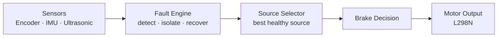

# Automotive Sensor Fault Detection & Isolation on QNX

**Team Straw Hats #20, Hyderabad** · Theme: Automotive · Platform: QNX Neutrino RTOS on Raspberry Pi 4


> A vehicle that knows which sense is lying, drops it, keeps driving on the rest, and re-admits it only after it has proved itself.

---

## Table of Contents

1. [Overview](#1-overview)
2. [Key Features](#2-key-features)
3. [System Architecture](#3-system-architecture)
4. [Hardware](#4-hardware)
5. [How It Works](#5-how-it-works)
6. [Fault Injection and Recovery Matrix](#6-fault-injection-and-recovery-matrix)
7. [Timing and Performance](#7-timing-and-performance)
8. [Repository Structure](#8-repository-structure)
9. [Getting Started](#9-getting-started)
10. [Configuration](#10-configuration)
11. [Alternative Implementation: Multi-Task Version](#11-alternative-implementation-multi-task-version)
12. [Known Limitations](#12-known-limitations)
13. [Future Scalability](#13-future-scalability)
14. [Documentation](#14-documentation)
15. [Team](#15-team)

---

## 1. Overview

Modern vehicles rely on a few sensors to decide when to accelerate, steer and brake. When one of them silently lies (stuck, frozen, noisy, or contradicting its neighbours), the controller keeps acting on bad data and safety is compromised.

This project is a real-time system that **detects** such faults, **isolates** the faulty sensor, and **keeps the vehicle driving** on the sources that are still healthy. A removed sensor is re-admitted only after it proves itself healthy again.

**Demonstration task:** the robot measures its distance to an obstacle while at rest, drives towards it, and brakes so that it stops at a set gap in front of the obstacle, even while sensors are being unplugged or frozen during the run.

| Sensor | Role | Interface |
|---|---|---|
| Wheel encoder (LM393) | Speed and distance travelled | GPIO 17 |
| MPU6050 IMU | Motion and acceleration | I²C `/dev/i2c1`, address `0x68` |
| HC-SR04 ultrasonic | Distance to obstacle | TRIG GPIO 23, ECHO GPIO 24 |

### Failure modes covered

| Failure mode | Meaning |
|---|---|
| Stuck-at | Sensor reports a constant value regardless of reality |
| Frozen | Sensor keeps returning identical samples |
| No pulses | Encoder stops producing edges |
| Noisy | Readings too scattered to trust |
| Contradictory | Two sensors disagree about what the vehicle is doing |
| Lost I²C / GPIO | Bus or pin stops responding altogether |

### Success criteria

The system succeeds when it can **detect and isolate a fault within a bounded deadline**, **keep driving on healthy sources**, and **never brake late**.

---

## 2. Key Features

- **Boot-time sensor qualification.** The robot refuses to move until every sensor has proved itself, and reports *why* when one fails.
- **Runtime fault detection** for frozen output, I²C failure and encoder silence.
- **Cross-sensor check.** Encoder and IMU together tell a genuine sensor fault apart from a robot that is simply stalled (motor, driver or battery problem).
- **Graceful degradation.** Best available source wins: encoder, then IMU dead-reckoning, then safe stop.
- **Automatic recovery** for each sensor, without blocking the control loop.
- **Speed-aware braking.** The brake point depends on velocity, so the robot brakes earlier when it is faster.
- **Safety guard.** SIGINT/SIGTERM brake the motors before exit; loss of both encoder and IMU triggers an immediate stop.
- **Deterministic timing.** Single `SCHED_FIFO` thread with absolute-deadline timers (no cumulative drift).

---

## 3. System Architecture



The whole control path runs as **one real-time thread** (`SCHED_FIFO`, priority 56) on a fixed **2 ms loop** paced by `clock_nanosleep()` with `TIMER_ABSTIME`. Sensor reading, fault detection, recovery and motor output all happen inline, sharing the vehicle state (position `x`, velocity `v`) and per-sensor health flags.

### Design decisions

| Decision | Reason |
|---|---|
| Single `SCHED_FIFO` thread, priority 56 | Keeps timing analysable; no context switches or priority inversion between stages |
| No separate processes or IPC | Shortest worst-case path (trade-off: no fault containment between components, see [Future Scalability](#13-future-scalability)) |
| `ThreadCtl(_NTO_TCTL_IO, 0)` called once | I/O privilege acquired a single time at start-up |
| Memory-mapped GPIO (`mmap_device_memory`, base `0xFE200000`) | Avoids system-call overhead for pin reads and writes |
| I²C through `devctl()` on `/dev/i2c1` | Native QNX I²C resource manager, no extra library |
| Absolute-deadline timers | Zero cumulative drift in the loop period |

### Sensor states

Every sensor is always in one of three states:

```
        fault detected                recovery succeeds
  OK ------------------> FAULTY -----------------------> OK
                            |                              ^
                            +--> RECOVERING ---------------+
```

---

## 4. Hardware

### Components

| Component | Notes |
|---|---|
| Raspberry Pi 4 | Runs QNX, powered from its own supply (power bank) |
| HC-SR04 ultrasonic sensor | 5 V part; ECHO needs a 1 kΩ / 2 kΩ voltage divider |
| MPU6050 (GY-521) IMU | I²C, address `0x68` (AD0 to GND) |
| LM393 slotted opto encoder + slotted disc | One wheel, 20 slots |
| L298N motor driver + 2 DC motors | Motor pack 7–12 V, shared ground with the Pi |
| Jumper wires, resistors (1 kΩ, 2 kΩ) | |

### Pin map

| Device | Signal | Header pin | BCM GPIO |
|---|---|---|---|
| HC-SR04 | VCC / GND | 2 (5 V) / 6 (GND) | , |
| HC-SR04 | TRIG | 16 | 23 |
| HC-SR04 | ECHO (via 1k/2k divider) | 18 | 24 |
| MPU6050 | VCC / GND | 1 (3V3) / 9 (GND) | , |
| MPU6050 | SDA / SCL | 3 / 5 | 2 / 3 |
| Encoder | VCC / GND | 17 (3V3) / 14 (GND) | , |
| Encoder | DO | 11 | 17 |
| L298N | IN1 / IN2 | 29 / 31 | 5 / 6 |
| L298N | IN3 / IN4 | 33 / 35 | 13 / 19 |

### Wiring notes

- **ECHO divider:** ECHO swings 0 to 5 V and the Pi tolerates 3.3 V. The 1 kΩ / 2 kΩ divider gives about 3.3 V.
- **Common ground:** Pi GND (pin 34), L298N GND, battery negative and all sensor grounds must be tied together.
- **L298N:** keep the ENA/ENB jumpers fitted (full-on). Do **not** connect the L298N 5 V output to the Pi.
- **IMU orientation:** mount so that **+X points forward** (if it points backward, set `FWD_SIGN` to `-1.0`).
- **Encoder:** powered from 3.3 V so DO is safe for the Pi.

Full wiring and task priorities: [`docs/WIRING_AND_PRIORITIES.md`](docs/WIRING_AND_PRIORITIES.md).

---

## 5. How It Works

### Phase 1: Rest and boot-time qualification (3 s)

The robot must stay still. The ultrasonic sensor measures the distance and the IMU bias and noise are measured, then the ultrasonic sensor is switched off.

| Sensor | Qualification rule |
|---|---|
| Ultrasonic | At least 10 valid echoes, spread of the central 80 % ≤ 5 cm, median used as the reference distance. Up to 3 retries. |
| IMU | At least 100 samples, noise standard deviation ≤ 0.20 m/s², bias within range, output not frozen. Up to 3 retries with re-initialisation. |

If the ultrasonic sensor cannot be qualified, the robot **does not move** unless a distance is supplied manually with `-d <cm>`.

### Phase 2: Drive

The distance and velocity source is chosen every tick, best available first:

| Encoder | IMU | Source used |
|---|---|---|
| OK | OK | Encoder distance and velocity (IMU velocity is re-seeded from the encoder, so it does not drift) |
| FAULTY | OK | IMU dead-reckoning, with extra early braking margin |
| OK | FAULTY | Encoder velocity over a fixed interval |
| FAULTY | FAULTY | **Safe stop** (or velocity-hold if `BOTH_LOST_STOP` is set to 0) |

**Braking model.** The robot brakes when

```
remaining distance <= COAST_MIN_CM + COAST_K * v^2 (+ extra margin if degraded)
```

so the faster it moves, the earlier it brakes. After braking, tracking continues until the robot has really stopped. The run prints a suggested `COAST_K` to tune for your robot.

### Runtime fault detection

| Fault | Rule |
|---|---|
| IMU frozen | 40 identical consecutive raw samples |
| IMU bus failure | 5 consecutive I²C read errors |
| Encoder silent | After a 600 ms grace period, 400 ms without pulses **while the IMU reports motion** |
| Stalled robot | Encoder silent **and** IMU sees no motion: reported as `STALLED`, **not** blamed on a sensor |

The encoder/IMU cross-check is what separates a genuine sensor fault from a stalled vehicle. Neither sensor alone could make that distinction.

### Recovery

| Sensor | Recovery |
|---|---|
| IMU | Non-blocking state machine: I²C re-open, device reset, re-init, then 12 fresh clean reads. Up to 3 attempts. IMU velocity is re-seeded from the encoder afterwards. |
| Encoder | GPIO pin re-armed every interval. After 4 pulses (and IMU-confirmed motion) the encoder is re-synchronised to the dead-reckoned position and used again. |
| Ultrasonic | Up to 3 re-measurements (1.5 s each), then the manual `-d` distance, otherwise the robot stays put. |
| Both encoder and IMU lost | Immediate brake and abort. |

### Example log format

Faults are printed the moment they are detected and summarised at the end:

```
[   0.00s] *** MPU6050 IMU is FAULTY: <reason>
[   0.30s] >>> MPU6050 init retry 1/3
[   1.84s] +++ MPU6050 IMU RECOVERED (device reset + re-init)

================== SENSOR STATUS ==================
 Ultrasonic HC-SR04   : OK
 MPU6050 IMU          : OK (recovered)   [faults=1 recovered=1] last: <reason>
 Rotary encoder       : OK
===================================================
```

(Timestamps and reasons above are illustrative; the line formats are those produced by the program.)

---

## 6. Fault Injection and Recovery Matrix

| Injection (how to trigger) | Detection rule | Recovery |
|---|---|---|
| I²C fault (pull SDA or SCL) | 5 failed reads | Re-open, reset, 12 clean reads |
| Frozen IMU | 40 identical samples | Same reset, up to 3 attempts |
| Encoder DO pulled or slot blocked | 400 ms no pulses + IMU motion | Wait for 4 edges, re-sync |
| Ultrasonic unplugged (pull TRIG or ECHO) | Fewer than 10 valid pings or spread > 5 cm | 3 retries (1.5 s each) or `-d` |
| Encoder and IMU both lost | `BOTH_LOST_STOP = 1` | Brake, abort |
| `Ctrl-C` / SIGTERM | Signal handler | Brake, `_exit(1)` |

To test recovery, plug the wire back in while the program is running.

---

## 7. Timing and Performance

These values follow directly from the constants in the source code.

| Metric | Value |
|---|---|
| Control loop period | 2 ms fixed |
| Encoder-silence fault deadline | ≤ 400 ms (after 600 ms start-up grace) |
| IMU I²C fault deadline | ≤ 5 read attempts |
| IMU frozen fault deadline | ≤ 40 identical samples |
| Faulty sensor removed from loop | Within 1 tick of being flagged |
| Dual-loss safe stop | ≤ 1 tick (2 ms) |
| Encoder distance resolution | 0.51 cm per count (20.4 cm wheel, 20 slots, both edges) |

| Recovery path | Time |
|---|---|
| IMU re-initialisation | ≈ 230 ms |
| Encoder re-synchronisation | ≤ 400 ms |
| Ultrasonic worst-case boot | ≈ 7.5 s (3 s rest + 3 retries × 1.5 s), boot only |

The ultrasonic busy-wait happens only at boot, never in the steady-state loop.

---

## 8. Repository Structure

```
.
├── README.md
├── .gitignore
├── src/
│   ├── fault_tolerant_single_thread/
│   │   ├── stop_at_distance_ft.c      Main fault-tolerant program
│   │   └── Makefile
│   └── ft_robot_multitask/
│       ├── qnx_ftrobot.c              Multi-task variant (2-of-3 voting)
│       └── Makefile
├── tests/                             Single-sensor bring-up tests
│   ├── test_ultrasonic.c
│   ├── test_mpu6050.c
│   ├── test_encoder.c
│   ├── test_motor.c
│   ├── qgpio.h                        GPIO helper
│   └── Makefile
└── docs/
    ├── WIRING_AND_PRIORITIES.md
    ├── Project_Documentation.docx
    └── Straw_Hats_Sensor_Fault_Detection.pptx
```

---

## 9. Getting Started

### Prerequisites

- QNX Software Development Platform (SDP 7.1 or 8.0) with QNX Momentics IDE or the command-line tools
- Raspberry Pi 4 running a QNX image that provides `/dev/i2c1`
- Network access from the host to the Pi (`scp` / `ssh`)
- Hardware wired as described in [Hardware](#4-hardware)

### 1. Clone

```bash
git clone https://github.com/<your-username>/<repo-name>.git
cd <repo-name>
```

### 2. Set up the QNX environment

```bash
source ~/qnx800/qnxsdp-env.sh      # use your own SDP path (qnx710 for 7.1)
```

### 3. Verify each component with the bring-up tests

```bash
cd tests
make                               # builds all four tests for aarch64le
make deploy PI=<pi-ip>             # copies them to the Pi
```

Run each test on the Pi (as root) and confirm the sensor behaves before moving on: `test_ultrasonic`, `test_mpu6050`, `test_encoder`, `test_motor`. **Lift the wheels off the ground for the first motor test.**

### 4. Build the main program

```bash
cd src/fault_tolerant_single_thread
make
scp stop_at_distance_ft root@<pi-ip>:/tmp/
```

Or build directly:

```bash
qcc -V gcc_ntoaarch64le -o stop_at_distance_ft stop_at_distance_ft.c
```

### 5. Run (on the Pi, as root)

```bash
ls /dev/i2c*                       # /dev/i2c1 must exist
/tmp/stop_at_distance_ft           # normal run
```

**Keep the robot completely still for the first 3 seconds.**

| Command | Behaviour |
|---|---|
| `./stop_at_distance_ft` | Normal run |
| `./stop_at_distance_ft -d 60` | Use a manual distance of 60 cm, **only** if the ultrasonic sensor is faulty |
| `./stop_at_distance_ft -s` | Sensor self-test, motors stay off (spin a wheel by hand when asked) |

### Exit codes

| Code | Meaning |
|---|---|
| 0 | Completed normally |
| 2 | Distance could not be determined and no `-d` given (robot did not move) |
| 3 | Required travel exceeds the safety limit |
| 4 | Run aborted (safe stop, stall, or time limit) |

### 6. Calibrate

Measure the real final gap with a ruler. The program prints a suggested `COAST_K`; update it in the source and rebuild.

---

## 10. Configuration

All settings are `#define` constants at the top of `stop_at_distance_ft.c`.

| Setting | Default | Purpose |
|---|---|---|
| `WHEEL_CIRC_CM` | 20.4 | Tyre circumference |
| `ENC_SLOTS` | 20 | Slots on your encoder disc (**check this**) |
| `COUNT_BOTH_EDGES` | 1 | Count rising and falling edges |
| `STOP_GAP_CM` | 5.0 | Final gap to the object |
| `SAFETY_MARGIN_CM` | 2.0 | Extra distance to stay short of the target |
| `REST_TIME_MS` | 3000 | Rest and measuring time |
| `MAX_TRAVEL_CM` / `MAX_DRIVE_S` | 300 / 20 | Safety limits |
| `COAST_MIN_CM` / `COAST_K` | 1.0 / 0.004 | Braking model |
| `BOTH_LOST_STOP` | 1 | Brake at once if encoder and IMU are both lost |
| `IMU_FROZEN_N` | 40 | Identical samples that mean "frozen" |
| `MAX_I2C_FAILS` | 5 | Consecutive read errors that mean "bus fault" |
| `ENC_FAULT_MS` / `ENC_GRACE_MS` | 400 / 600 | Encoder silence deadline / start-up grace |
| `FWD_SIGN` | 1.0 | Set to `-1.0` if IMU +X points backward |
| `LEFT_FWD_*` / `RIGHT_FWD_*` | , | Flip if a motor turns the wrong way |

---

## 11. Alternative Implementation: Multi-Task Version

`src/ft_robot_multitask/qnx_ftrobot.c` implements the same idea as a set of cooperating real-time tasks with rate-monotonic priorities (`SCHED_FIFO`, one `PTHREAD_PRIO_INHERIT` mutex, QNX pulses between tasks).

| Task | Period | Priority |
|---|---|---|
| Encoder sampler | 1 ms | 56 |
| Fault Manager + Recovery | 20 ms | 54 |
| Control | 20 ms | 52 |
| IMU acquisition | 20 ms | 50 |
| Ultrasonic acquisition | 60 ms | 48 |
| Logger / dashboard | 200 ms | 20 |

It adds sensor health states `HEALTHY → SUSPECT → FAILED → RECOVERING → HEALTHY`, **2-of-3 velocity voting**, and system modes `NORMAL`, `DEGRADED` and `SAFE`. Build with `make` in that folder. Details: [`docs/WIRING_AND_PRIORITIES.md`](docs/WIRING_AND_PRIORITIES.md).

---

## 12. Known Limitations

- The encoder has a single channel, so it cannot detect direction (forward only).
- IMU dead-reckoning is a short-term backup, not a long-term odometer; it drifts without encoder re-seeding.
- The ultrasonic sensor is used only at rest, so an obstacle that appears during the run is not detected.
- A single thread means a hung driver call can stall the whole loop (no fault containment).
- Tuned for a small wheeled platform; constants such as `COAST_K` must be re-calibrated for other robots.

---

## 13. Future Scalability

- **Split into separate QNX processes with IPC pulses**, so the High Availability Manager (HAM) can restart hung drivers without taking down the control loop.
- **CPU sets and thread affinity:** control loop on core 0, I²C on core 1, a watchdog on core 2.
- **CAN bus sensors** to exercise authentic automotive faults such as bus-off and error frames.
- **Redundant IMU:** a second MPU6050 on another I²C bus for 2-of-3 voting across IMUs.
- **WCET logging and a fault-injection matrix** as groundwork for ISO 26262 pre-compliance.

---

## 14. Documentation

| Document | Description |
|---|---|
| [`docs/Project_Documentation.docx`](docs/Project_Documentation.docx) | Full project write-up: scenario, architecture, execution, resilience, learning outcomes |
| [`docs/WIRING_AND_PRIORITIES.md`](docs/WIRING_AND_PRIORITIES.md) | Wiring tables, power notes, task priorities |
| [`docs/Straw_Hats_Sensor_Fault_Detection.pptx`](docs/Straw_Hats_Sensor_Fault_Detection.pptx) | Project presentation |

---

## 15. Team

**Team Straw Hats #20**, Hyderabad

| Name | Role |
|---|---|
| `<Member 1>` | `<Role>` |
| `<Member 2>` | `<Role>` |
| `<Member 3>` | `<Role>` |
